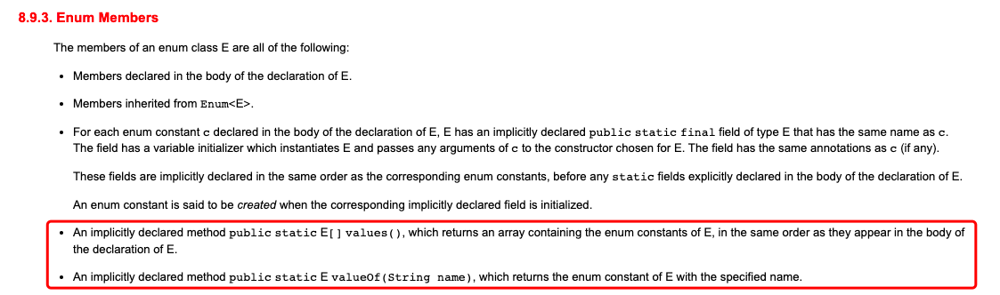

# basic-enum
我对 java 中的枚举类型的理解

## 1 参考资料
### 1.1 [Effective Java](https://github.com/clxering/Effective-Java-3rd-edition-Chinese-English-bilingual) 中的相关内容
此书中有若干条是和枚举有关的，列举如下

* [Item 34: Use enums instead of int constants（用枚举类型代替 int 常量）](https://github.com/clxering/Effective-Java-3rd-edition-Chinese-English-bilingual/blob/dev/Chapter-6/Chapter-6-Item-34-Use-enums-instead-of-int-constants.md)
* [Item 35: Use instance fields instead of ordinals（使用实例字段替代序数）](https://github.com/clxering/Effective-Java-3rd-edition-Chinese-English-bilingual/blob/dev/Chapter-6/Chapter-6-Item-34-Use-enums-instead-of-int-constants.md)
* [Item 36: Use EnumSet instead of bit fields（用 EnumSet 替代位字段）](https://github.com/clxering/Effective-Java-3rd-edition-Chinese-English-bilingual/blob/dev/Chapter-6/Chapter-6-Item-36-Use-EnumSet-instead-of-bit-fields.md)
* [Item 37: Use EnumMap instead of ordinal indexing（使用 EnumMap 替换序数索引）](https://github.com/clxering/Effective-Java-3rd-edition-Chinese-English-bilingual/blob/dev/Chapter-6/Chapter-6-Item-37-Use-EnumMap-instead-of-ordinal-indexing.md)
* [Item 38: Emulate extensible enums with interfaces（使用接口模拟可扩展枚举）](https://github.com/clxering/Effective-Java-3rd-edition-Chinese-English-bilingual/blob/dev/Chapter-6/Chapter-6-Item-38-Emulate-extensible-enums-with-interfaces.md)


### 1.2 [CFR - another java decompiler](https://www.benf.org/other/cfr/index.html) 中的相关内容
* [How are Enums implemented?](https://www.benf.org/other/cfr/how-are-enums-implemented.html)
* [How is switch-on-enum implemented?](https://www.benf.org/other/cfr/switch-on-enum.html)

## 2 正文
java 中提供了对 [Enum(枚举类型)](https://docs.oracle.com/javase/specs/jls/se18/html/jls-8.html#jls-8.9) 的支持。
我们通过具体的例子来探究相关的内容吧。

### 2.1 一个简单的例子
我在 [Direction.java](code/Direction.java) 中写一个简单的枚举类，
其代码如下

```java
public enum Direction {
  EAST,
  WEST,
  SOUTH,
  NORTH;
}
```


### 2.2 从 `class` 文件来了解 `Direction`
在 [code](code) 目录下，可以用如下命令编译 `Direction.java` + 查看 `class` 文件的内容

```bash
javac Direction.java
javap -cp . -v -p Direction
```

手工查看 `class` 文件的内容，比较费力（对我来说是比较费力的），
所以可以考虑借助 [cfr](https://www.benf.org/other/cfr/) 之类的工具。
我在 [code](code) 目录下放置了一个 cfr 的 `jar` 包(大家可以去 cfr 的网站上自行下载)。

在 [code](code) 目录下执行如下命令可以查看 cfr 的帮助信息
```bash
java -jar cfr-0.152.jar --help
```

在 [code](code) 目录下，执行如下命令，可以将 `class` 文件反编译之后的结果保存到 [decompiled_by_cfr.java](code/decompiled_by_cfr.java) 中。
```bash
java -jar cfr-0.152.jar --sugarenums false Direction > decompiled_by_cfr.java
```

(这里啰嗦几句，尽信书则不如无书，cfr 这个工具提供的结果未必绝对准确，而且它支持的选项比较多，难免有用得不准确的时候，如果对它生成的结果有疑问，还是要以 `class` 文件的内容为准)


[decompiled_by_cfr.java](code/decompiled_by_cfr.java) 的内容如下
```java
/*
 * Decompiled with CFR 0.152.
 */
public final class Direction
extends Enum<Direction> {
    public static final /* enum */ Direction EAST = new Direction("EAST", 0);
    public static final /* enum */ Direction WEST = new Direction("WEST", 1);
    public static final /* enum */ Direction SOUTH = new Direction("SOUTH", 2);
    public static final /* enum */ Direction NORTH = new Direction("NORTH", 3);
    private static final /* synthetic */ Direction[] $VALUES;

    public static Direction[] values() {
        return (Direction[])$VALUES.clone();
    }

    public static Direction valueOf(String string) {
        return Enum.valueOf(Direction.class, string);
    }

    private Direction(String string, int n) {
        super(string, n);
    }

    private static /* synthetic */ Direction[] $values() {
        return new Direction[]{EAST, WEST, SOUTH, NORTH};
    }

    static {
        $VALUES = Direction.$values();
    }
}
```

我们可以看出以下几点
1. `Direction` 继承了 `Enum` (所以可以在 `Direction` 类中调用 `Enum` 中对应的方法)
2. 反编译之后，多出了 `valueOf(String)` 方法和 `values()` 方法(源码里没有这两个方法)
3. `EAST`, `WEST`, `SOUTH`, `NORTH` 实际上是 `Direction` 中的`4`个字段

下面展开说一说
#### 2.2.1 `Direction` 继承了 `Enum`

`Direction` 的构造函数调用了 `Enum` 的构造函数(代码如下)
```java
private Direction(String string, int n) {
    super(string, n);
}
```

`Enum` 中的这个构造函数代码如下
```java
/**
 * Sole constructor.  Programmers cannot invoke this constructor.
 * It is for use by code emitted by the compiler in response to
 * enum class declarations.
 *
 * @param name - The name of this enum constant, which is the identifier
 *               used to declare it.
 * @param ordinal - The ordinal of this enumeration constant (its position
 *         in the enum declaration, where the initial constant is assigned
 *         an ordinal of zero).
 */
protected Enum(String name, int ordinal) {
    this.name = name;
    this.ordinal = ordinal;
}
```

我们看看 `Enum` 中 `name` 和 `ordinal` 的 javadoc 说了些什么
```java
/**
 * The name of this enum constant, as declared in the enum declaration.
 * Most programmers should use the {@link #toString} method rather than
 * accessing this field.
 */
private final String name;

...(略去不相关内容)

/**
 * The ordinal of this enumeration constant (its position
 * in the enum declaration, where the initial constant is assigned
 * an ordinal of zero).
 *
 * Most programmers will have no use for this field.  It is designed
 * for use by sophisticated enum-based data structures, such as
 * {@link java.util.EnumSet} and {@link java.util.EnumMap}.
 */
private final int ordinal;
```

简单概括一下
1. `name` 要和源码中定义的枚举常量的名字一致
2. `ordinal` 要和源码中声明的次序对应(从`0`开始编号)，这个字段会被 `EnumMap` 和 `EnumSet` 用到

看来这两个字段挺重要的。
这两个字段的访问级别都是 `private`，那么要如何访问这两个字段呢？
我们去 `Enum` 里查找，会发现有 `name()` 和 `ordinal()` 这两个方法(代码如下)
```java
/**
 * Returns the name of this enum constant, exactly as declared in its
 * enum declaration.
 *
 * <b>Most programmers should use the {@link #toString} method in
 * preference to this one, as the toString method may return
 * a more user-friendly name.</b>  This method is designed primarily for
 * use in specialized situations where correctness depends on getting the
 * exact name, which will not vary from release to release.
 *
 * @return the name of this enum constant
 */
public final String name() {
    return name;
}

...(略去不相关内容)

/**
 * Returns the ordinal of this enumeration constant (its position
 * in its enum declaration, where the initial constant is assigned
 * an ordinal of zero).
 *
 * Most programmers will have no use for this method.  It is
 * designed for use by sophisticated enum-based data structures, such
 * as {@link java.util.EnumSet} and {@link java.util.EnumMap}.
 *
 * @return the ordinal of this enumeration constant
 */
public final int ordinal() {
    return ordinal;
}
```

这两个方法都是 `final` 的，所以在子类中就无法对它们进行 `override` (比如在 `Direction` 里是无法 `override` 这两个方法的)，这样可以保证它们返回的分别是 `name` 字段和 `ordinal` 字段的值。

### 2.2.2 反编译之后，多出了 `valueOf(String)` 方法和 `values()` 方法
在 `Direction` 的源码中并没有看到这两个方法，这两个方法是编译器自动生成的。
不过为何编译器要做这件事呢？
[java 语言规范的 8.9.3. Enum Members](https://docs.oracle.com/javase/specs/jls/se18/html/jls-8.html#jls-8.9.3) 中提到了相关内容(在下图的红框内)

所以这是 java 语言层面的规定


### 2.2.3 `EAST`, `WEST`, `SOUTH`, `NORTH` 实际上是 `Direction` 中的`4`个字段
在 [decompiled_by_cfr.java](code/decompiled_by_cfr.java) 的开头几行有如下代码
```java
public static final /* enum */ Direction EAST = new Direction("EAST", 0);
public static final /* enum */ Direction WEST = new Direction("WEST", 1);
public static final /* enum */ Direction SOUTH = new Direction("SOUTH", 2);
public static final /* enum */ Direction NORTH = new Direction("NORTH", 3);
```
可见 `EAST`, `WEST`, `SOUTH`, `NORTH` 本质上是 `Direction` 中定义的`4`个字段，
而这`4`个字段的类型也刚好是 `Direction`。
这样看下来，java 中的枚举就没那么神秘了。
`Enum` 这个类中定义了基本的字段(`name`, `ordinal`)和方法(`name()`, `ordinal()`等)，编译器在编译时会生成规定的方法(即 `valueOf(String)` 方法和 `values()` 方法)，
这样我们自己定义的枚举类就能运转起来了。


## 2.3 对 EnumMap 和 EnumSet 的理解
刚才提到 `Enum` 中的 `ordinal` 字段会被 `EnumMap` 和 `EnumSet` 用到。
那我们看看这两个类大致是怎么实现的吧。

1. [EnumMap.md](EnumMap.md)
2. [EnumSet.md](EnumSet.md)


【尚未完工】
